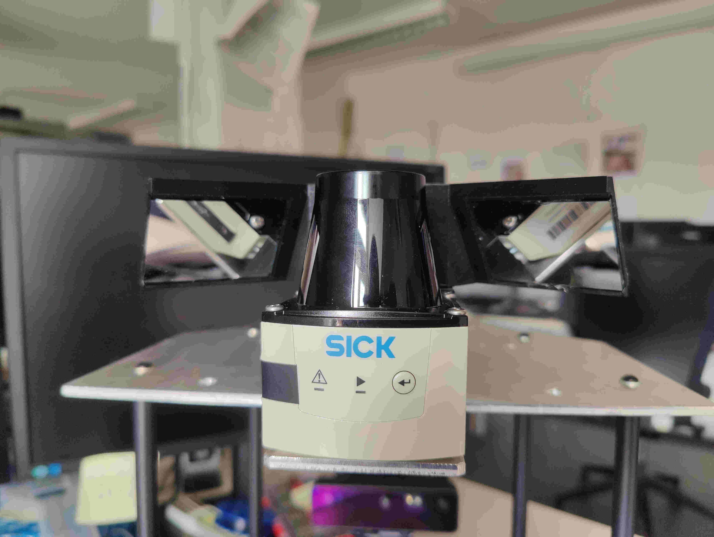
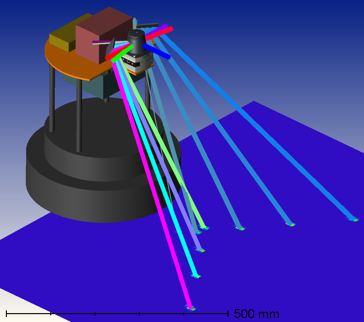

# lidar_mirror_fov_reshaper

This project provides functionality to calibrate and reshape the field of view (FOV) of a 2D-Lidar sensor, enhanced by two mirrors. The mirrors are used to reshape the 2D-FOV of the lidar sensor, in order to be able to view objects below its original planar FOV (within the xy-plane), thus a 3D-like FOV is created. The calibration is based on a two-step approach, calibrating the mirror positions and calibrating the mirror orientations. The runtime functionality reshapes the lidar FOV based on the calibrated mirror poses and can be used for further processing of the reshaped FOV (e.g. object detection, mapping, etc.). As a basis for all calibration operations, a rough parameter estimation is required, which for example can be obtained by ray-simulations within optical simulation software (e.g. Zemax) or from CAD models of the setup in use. A calibration procedure for such lidar-mirror setups is required, due to mechanical deviations and inaccuracies in the setup.

<div style="display: flex; align-items: center;">
  
  
</div>

Further informations about the main project (OpenSeeGround, 2025) in which those packages were developed and used can be found in the [OpenSeeGround](https://github.com/ioskn/OpenSeeGround) Project.

## Packages

- [lidar_mirror_fov_reshaper_transformation](#lidar_mirror_fov_reshaper_transformation) library package including operations to transform the mirrored lidar rays
- [lidar_mirror_fov_reshaper_calibration](#lidar_mirror_fov_reshaper_calibration) calibration package to calibrate the mirror poses relative to the lidar sensor
- [lidar_mirror_fov_reshaper_runtime](#lidar_mirror_fov_reshaper_runtime) runtime package to reshape the lidar FOV based on the calibrated mirror poses

## lidar_mirror_fov_reshaper_transformation

Library package containting operations to transform lidar rays (in euclidean space)

## lidar_mirror_fov_reshaper_calibration

Functionality to calibrate the attached mirror poses. Only supports usage of exactly two mirrors in use. Supports lidar sensors capable of measuring intensity values and those that are not. Calibration is based on a independent two-step approach:

### Prerequisites

- Calibration Plane, equipped with retroflector-foil/hole

- Infrared-Visualizer to position the lidar-sensor and the calibration plane

1. Calibrate the mirror positions, relative to the lidar sensor

- Cover the mirrors (e.g. with a sheet of paper) to avoid reflections as input for the calibration

2. Calibrate the mirror orientations, relative to the lidar sensor

- Position the lidar sensor in front of the calibration plane, with the mirrors uncovered. All FOVs should be hitting the calibration plane, both unmirrored and mirrored FOVs. This positioning is performed by using the infrared-visualizer.

## lidar_mirror_fov_reshaper_runtime

Contains the runtime functionality to reshape the lidar field of view (FOV) based on the calibrated mirror poses. Supports several types of FOVs to be published, details can be found in the documentation and the corresponding [configuration file](lidar_mirror_fov_reshaper_runtime/config/params.yaml).

## Documentation

### Installation Prerequisites

```bash
apt install doxygen # Documentation Generator
pip install -U sphinx breathe # Documentation Frameworks
pip install sphinx_rtd_theme # Documentation Theme
```

### Build & View Documentation

```bash
cd <path/to/lidar_mirror_fov_reshaper>
cd docs/sphinx
make html # build documentation as html
```

```bash
<browser_of_choice> <path/to/lidar_mirror_fov_reshaper>/docs/sphinx/build/html/index.html
```

### View Raw Doxygen Documentation

```bash
<browser_of_choice> <path/to/lidar_mirror_fov_reshaper>/docs/doxygen/build/html/index.html
```

## Acknowledgements

This research was conducted as part of the project [“OpenSeeGround”](https://github.com/ioskn/OpenSeeGround) in the research programme “Autonomous Robotics”, has been financed by the Baden-Württemberg Stiftung gGmbH. (<https://www.bwstiftung.de/de/programm/autonome-robotik>).

## References & Publications

- [OpenSeeGround](https://github.com/ioskn/OpenSeeGround), main project in which the packages were developed and used. Including hardware components and further software packages developed.

- [Andreas Löffler, Hartmut Gimpel, "Calibration of a Mirror Enhanced 2D-Lidar for Ground Detection"](https://opus.htwg-konstanz.de/frontdoor/index/index/docId/5285), presented on ICRA@40 conference 2024. (Only abstract publicly available)

- Final paper TBA

## License

All packages are distributed under the [Apache 2.0 license](https://www.apache.org/licenses/LICENSE-2.0), 2025 Andreas Loeffler
